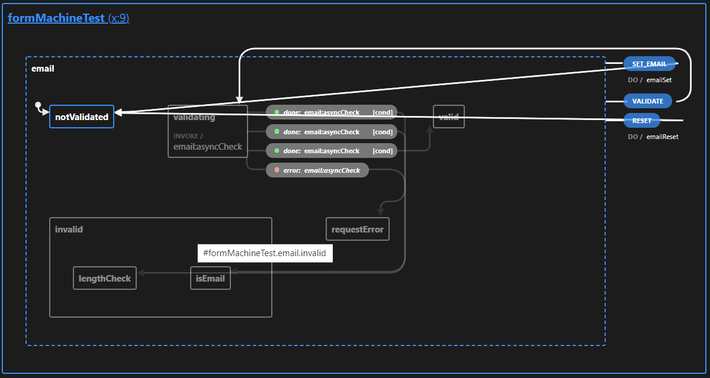

### Реализованно
- синхронная валидация одного поля
- асинхронная валидация одного поля

### Реализация
Визуализация statechart'а если есть асинхронная валидация


Визуализация statechart'а если нет асинхронной валидации


У Statechart'а параллельные состояния для каждого поля формы. Каждое поле имеет 5 состояний:
- `notValidated` - начальное состояние. Так же переход в это состояние происходит после вызова методов `set` или `reset`
- `validating` - состояние когда валидация в процессе. Переход в это состояние происходит после вызова метода `validate` 
  Если есть асинхронные валидации, поле будет в состоянии validating пока не завершатся все асинхронные операции.
  Если асинхронных валидаций нет, то запустив все синхронные валидации поле перейдет в состояние valid или invalid
- `valid` - состояние если значение валидное - попадаем сюда если все валидации вернули `true`
- `invalid` - состояние если значение не валидное - попадаем сюда если хотя бы одна валидация вернула `false`
- `requestError` - состояние ошибки асинхронной операции. Это состояние возможно только если есть хотя бы одна асинхронная валидация

Так же пользователю доступны три метода:
- `set` - устанавливает значение в `context` statechart'а и переводит поле в состояние `notValidated`. Можно вызывать с несколькими полями - `set({ email: "newEmailValue", password: "newPasswordValue" })`;
- `reset` - устанавливает всем полям в context значения равные `defaultValue` и переводит все поля в состояние `notValidated`, то есть переводит всю машину в начальное состояние;
- `validate` - переводит все поля в состояние `validating`;

Для синхронной валидации используется Eventless ("Always") Transitions чтобы автоматически перейти из состояния `validating` без дополнительного события.

### API
`useFormMachine(config: formConfig): MachineResult` - хук, который возвращает statechart и методы для работы с ним

`formConfig` - конфиг формы, имеет следующую сигнатуру
`{ id: string, fields: Field[] }`

`Field` - конфиг поля, имеет следующую сигнатуру `{ name: string, defaultValue: any, validations: Validation[] }`

`Validation` - объект валидации. Имеет сигнатуру `{ name: string,  validator: (fieldValue|response) => boolean, request?: (fieldValue) => Promise}`
Если есть поле `request`, то в `validator` придет результат вызова `request`, в противном случае — значение поля. `validator` должен вернуть `true` если значение валидно.

`MachineResult` - результат вызова хука с сигнатурой `[formState, { set: ({ fieldName: fieldValue }) => void, validate: () => void, reset: () => void }]`. `formState` - объект текущего состояния statechart'а в формате [XState State](https://xstate.js.org/docs/guides/states.html#state-definition) 

### Пример
```js
import { useFormMachine } from '../lib'

const formConfig = {
  id: 'formMachineTest',
  fields: [
    {
      name: 'email',
      defaultValue: 'default@email.com',
      validations: [
        {
          name: 'lengthCheck',
          request: (email) => new Promise((resolve) => {
            setTimeout(() => resolve(email), 200)
          }),
          validator: (email) => email.length !== 0,
        },
        {
          name: 'isEmail',
          validator: (email) => email.includes('@'),
        },
      ],
    },
    {
      name: 'password',
      defaultValue: 'defaultPassword',
      validations: [
        {
          name: 'lengthCheck',
          request: (password) => new Promise((resolve) => {
            setTimeout(() => resolve(password), 200)
          }),
          validator: (password) => password.length >= 5,
        },
        {
          name: 'isSecure',
          validator: (password) => password.toLowerCase() !== password,
        },
      ],
    }
  ]
}

export function FormMultipleFieldsCombinedWithReset() {
  const [formState, { validate, set, reset }] = useFormMachine(formConfig)
  const handleSubmit = (e) => {
    e.preventDefault()
    validate()
  }
  const handleReset = (e) => {
    e.preventDefault()
    reset()
  }

  return (
    <form>
      <div>Multiple fields</div>
      <button onClick={handleReset}>RESET</button>
      <div>
        <input
          type="text"
          name="test"
          placeholder="Email"
          className={`${formState.matches('invalid') && 'input-invalid'} ${formState.matches('valid') && 'input-valid'}`}
          value={formState.context.email}
          onChange={(e) => set({ email: e.target.value})}
        />
        {formState.matches('email.invalid.lengthCheck') && <div className="input-error">lengthCheck failed</div>}
        {formState.matches('email.invalid.isEmail') && <div className="input-error">isEmail failed</div>}
      </div>
      <div>
        <input
          type="text"
          name="test"
          placeholder="Password"
          className={`${formState.matches('invalid') && 'input-invalid'} ${formState.matches('valid') && 'input-valid'}`}
          value={formState.context.password}
          onChange={(e) => set({ password: e.target.value })}
        />
        {formState.matches('password.invalid.lengthCheck') && <div className="input-error">lengthCheck failed</div>}
        {formState.matches('password.invalid.isSecure') && <div className="input-error">isSecure failed</div>}
      </div>
      <button type="submit" onClick={handleSubmit}>Validate</button>
    </form>
  )
}
```

### Почему выбрано такое API
- один конфиг вне зависимости сколько полей в форме
- один метод которые устанавливает значение любого поля или нескольких полей одновременно
- пользователь имеет контроль когда запускать валидацию
- юзеру предоставляются set, validate и reset методы, что лишает юзера необходимости знать о названиях событий
- запрос и проверка разделены на два отдельных поля, что способствует loose coupling
- если нет async валидаций, то все валидации будут выполнены синхронно
- поскольку для всей формы один конфиг и один statechart, значит функциональность можно будет расширять без глобальных изменений во внешнем API

### Недостатки и ограничения
- если есть хотя бы одна async валидация, то все проверки будут вызванный асинхронно
- у пользователя нет доступа к методу send statechart'а
- библиотека отвечает только за валидацию и не предоставляет API для сабмита формы, не следит за "измененностью" поля (touched, pristine, etc)

### Альтернативные варианты
1) Отдельный statechart для каждого поля. Преимущества:
- простота реализации библиотеки
2) Библиотека отвечающая не только за валидацию и за поведение формы в целом: submit, field state (touched, pristine, etc), etc. Преимущества:
- более user friendly API, так как больше вещей работают "из коробки"

### Как запустить
`npm i && npm start`